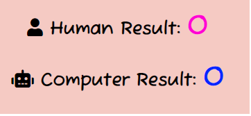

# Welcome To The Rock Paper Scissors Game!
This is a webpage were children and adults can play a simple game, that is well known in big parts of the world. The site is clean with gentle colours for the eyes. Easy to understand, using colours to determinate which is computer or human. Or you can read the text or follow the icons. The game has a level of difficulty, because the one hwo get 5 points first, is the winner. You can also decide to reset the game while you are playing. 

## Ux and UI
### Research
I know that a lot of people know this game, and know the rules. I have worked as a teacher for many years and know that especially children
are using this game to decide over things they want do or just play this simple game for having fun.
### Owner`s goal
* To have a webpage that offers simple and an easy game for people.
* To get more and more people that wants to use the game.
### User`s goals
* Children and adults can use this game to play a simple game to have fun.
* Children and adults can play this game to help deciding what to do next. One example can be that a teacher can use this game
in the classroom If the teacher wins over the computer, the students can play outside, if computer wins, the students can play inside.
* For people that wants to play a simple game.

### User Stories

* I visited the site for the first time, as a user I want to know what kind of webpage this is.
* As a user I want the webpage to be easy to use, clean and easy to understand.
* As a user I want to play the game without having problems playing it or understand it.
* As a user I want the webpage to be responsive if I want to use computer or mobile phone.

### wireframe and responsive web design

## Design
### font
I used a font from google font called Fuzzy Bubbles. Fuzzy bubbles looks like the name 'fuzzy',
the font reflect the mission of the webpage. To have fun and play the rock paper scissors game.

### Colours
I used colours from coolors.co where the site generates colour schemes. I choosed bright colours that mixed well together
and colours that would highlight the image screens for human and computer player. I also used different colours to the human and computer, so it will be easier to see the results.

### Images
I thought it would be more fun to use images of real items in the game, and not the usually hand gestures that we normally do playing this game. I took pictures of one stone, one scissor and one paper with my mobile phone and used those pictures in the game.

### Icones
I also used icons from fontawesome.com to make the titles more interesting and to help the player to connect the results to the player, so that people that can`t read english or are colourblind can understand this connection better.

## Features

### Logo
You find the logo in the middle of the header. The name gives the description of the site, it`s a rock paper scissors game.
I also added an icon that looks like the hand gesture rock, that can also help the user to understand better that it is a rock paper scissors game.

### Landing page
The webpage has only one page and the user can see the whole game and it`s content that will give a practically value for the user.

### Results
The Result section shows who are the players and the results. The results shares the same colours as the players. The user can easily understand where to look by reading, by colour or by icon.
the winner is the player that receives 5 points first.

### Players Screen
The screen shows a starting image of the different things a player can choose from, rock, paper or scissors.
The players are given a different colour.

### Footer
  The Footer has the same colour as the header and stays at the bottom of the page that makes it a nice border for the game.

### Future Features
* In the future, I would add more pages with a navigation bar that includes other games.
* I Would add contact information.
* I would add feedback form, where people can give feedback about the games.
* I would include a page where the people can read about the game rules.
* I would alert the winner in a more elegant way, maybe with a nice image attached to it.

### Technology
I used different technologies and languages to make this game and webpage.
* Coolors 
* Balsamiq 
* Fontawesome 
* Google Fonts
* Am I responsive
* VS-code
* Git Hub
* Jshint
* Chrome Dev Tool
* Css Validator
* Html Validator

### Language
* CSS
* HTML5
* Javascript

## Testing

### Game and buttons
* I am first testing that the hoover effect works on all the buttons.
* clicking on paper button, making sure the image of paper is displayed in the player screen.
Making sure the computer screen is now generating an image of the three choices in the computer screen. Then I check if the player or the computer has won the round and it generates a point to the right player in the result.
* clicking on rock button, making sure the image of rock is displayed in the player screen.
Making sure the computer screen is now generating an image of the three choices in the computer screen. Then I check if the player or the computer has won the round and it generates a point to the right player in the result.
* clicking on scissor button, making sure the image of scissor is displayed in the player screen.
Making sure the computer screen is now generating an image of the three choices in the computer screen. Then I check if the player or the computer has won the round and it generates a point to the right player in the result.
* Clicking on reset button, making sure that images are returned to starting images on player screen and computer screen. Making sure that the results are returned to zero.
* I am checking that the alert works when a player has reached 5 points and it declears hwo is the winner. After that I check if the game is resetting. 
* I am also checking that if player and computer decides the same button/image, it does not give any points to the players.

### responsive
* Checking if the webpage is responsive on a mobile phone, tablet and computer screen. Making sure it looks clean and correct.
** browsers**
* I have checked that the site works on different browser like chrome and microsoft edge.

### Validator tester
#### HTML
* The offical W3C validator showed no errors when tested.
#### CSS
* The official Jigsaw validator showed no errors when tested.
#### Javascript
* The JShint Javascript code quality tool showed no errors when tested, but showed one warning:
"Functions declared within loops referencing an outer scoped variable may lead to confusing semantics. (runGame)"
To fix this warning, I could try to to make the loop in to an own function, that would return playerChoice.

#### Metrics from Jshint
* There are 8 functions in this file.

* Function with the largest signature take 2 arguments, while the median is 0.

* Largest function has 8 statements in it, while the median is 5.5.

* The most complex function has a cyclomatic complexity value of 14 while the median is 2.

#### Accessibility
* Lighthouse gave high scores of accessibility.

## Bugs
* When I was finished coding and wanted to deploy my website, I discovered a problem. All my pictures was suddenly gone when clicking on my link. I tried first to google the problem and found out that the problem was a path problem. After asking tutors for help, I found out how to fix the problem. the way I had written the url link was like this url(/assets/images/paper.jpg). The path was looking for the images in a place where the images does not exist. I had to remove the slash (/), so it looked like this url(assets/images/paper.jpg), then the page worked correctly.

* When I tried to add a hoover effect on the buttons, I saw that the effect din`t work. I used chrome development tool and found out that the div for the result, used the same space as the buttons. When I made the result div smallar, the hoover effect on the buttons worked.

* I tried to make the function compareChoices() to work, but it didn`t work at all. First i wrote a console.log(hello), at the bottom of the function, to see if it runs trough the code but it didn't. I found out that I had given the numbers a string and not a number. I had written it like this:
else if (decisionChoice == "1" && computerChoice == "0"). It worked when I removed the strings and wrote it like this:
else if (decisionChoice == 1 && computerChoice == 0). My function finally worked.

* I made a loop of button of buttons with an eventlistener on it, to register when a button is clicked. I wanted to take the value of which button was clicked and add it into a new function runGame(). After a lot of research and tutor support, I found out that the problem, was that I had made an array, a list, but I needed the value of that one button that was clicked on. I found out that I could use e.target.dataset.choice to solve this problem, and I finally got the results that I wanted.

### Unfixed Bugs
No unfixed bugs.
## Deployment

1. First find the GitHub Repository

2. Locate and find the setting button on the top right above the repository.

3. Scroll down and find the GitHub pages. Right below the GitHub pages,
 click on this sentence: "Check it out here!"

4. Click on the "Branch" below the source and choose main.

5. A published link to the webpage will appear.

Here is the webpage link: https://beebooplena.github.io/Project-2/

## Credits 

* I would like to thank my mentor Dick Vlaanderen for guiding me.

* I would like to thank my friend Arne Velle for advice.

* I would like to thank the tutor support of code institute for supporting me.

* I would like to thank the slack community for help.

## Content

* I borrowes some of the CL love running project, a default code to make it easier to use css. Here is the original code from the CL love running project:

**{ margin:0;
padding: 0;
border: none; }

* I also borrowed the function for increment scores from Love Math project. Here is the original code from the Love Math project.

function incrementScore() {

 let oldScore = parseInt(document.getElementById("score").innerText);
 document.getElementById("score").innerText = ++oldScore;

* I also got inspired from Love Math project by using this term for writing a loop (button of buttons) and add an eventlistener  to it. Here is the original code from Love Math project:

document.addEventListener("DOMContentLoaded", function() {
    let buttons = document.getElementsByTagName("button");

    for (let button of buttons){
        button.addEventListener("click", function(){
            if (this.getAttribute("data-type") === "submit") {
                checkAnswer();
            } else {
                let gameType = this.getAttribute("data-type");
                alert(`You clicked ${gameType}`);
                runGame(gameType);
            }
        })

    }

* I also got inspired from the project 2 Scope, adding data choice and aria-label to buttons, so I borrowed that idea and used that in my own project. Here is a picture showing the original code.

* I used icons from font awesome

* I found colours by using coolors.co 

* I used a font from google font.

* I used icons from fontawesome.
### Media

* I took the pictures of rock, paper and scissors and used the pictures in the game.